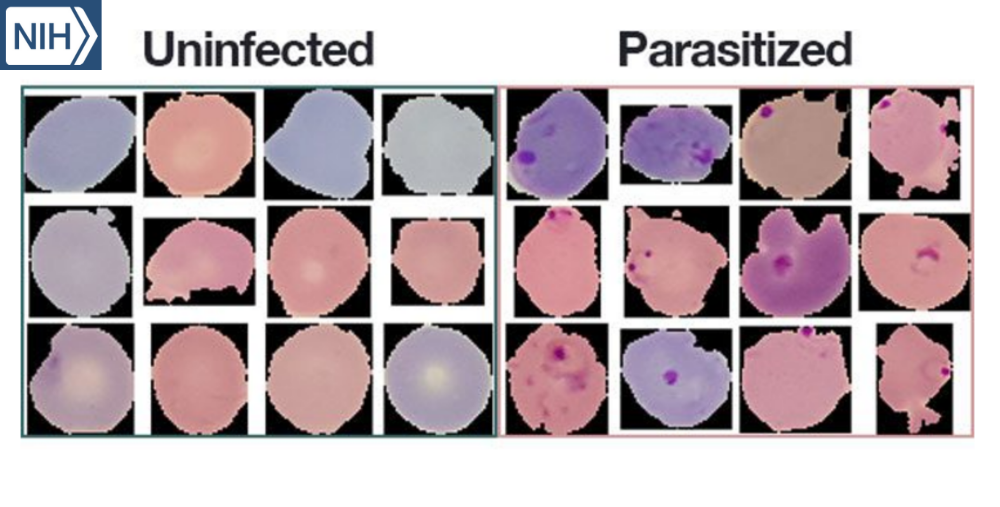

# Détection Du Paludisme
 

## Introduction :

-  Le paludisme, une maladie grave transmise par les moustiques, affecte des millions chaque année, surtout dans les régions tropicales.
-  Actuellement, le diagnostic repose sur l'examen microscopique des frottis sanguins, nécessitant une expertise médicale.
-  Ce projet développe un modèle de réseau neuronal pour différencier rapidement et avec précision les cellules sanguines infectées par le paludisme des cellules saines
-  Structure de projet :
    - 1.Manipulation de la Donnée : Préparation et augmentation des données pour l'entraînement des modèles.
    - 2.Entraînement de Modèles : Implémentation et entraînement de trois modèles CNN différents.
    - 3.Évaluation des Modèles : Test et évaluation des performances des modèles sur un jeu de données de test.
